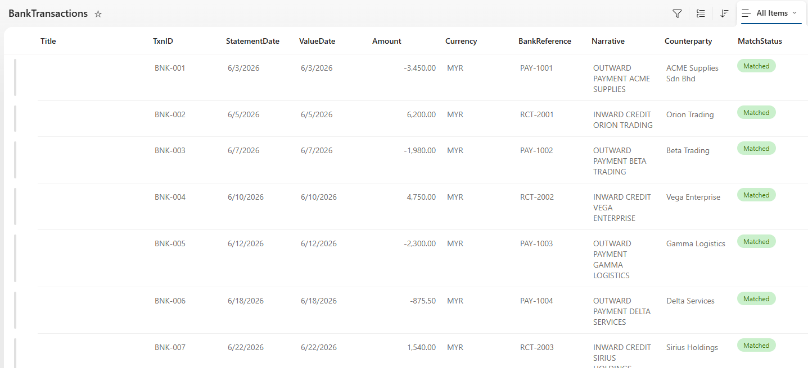
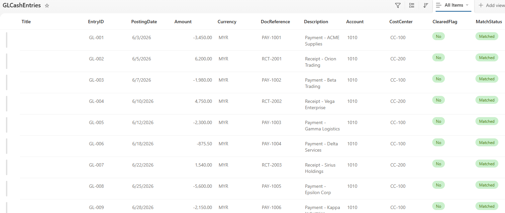
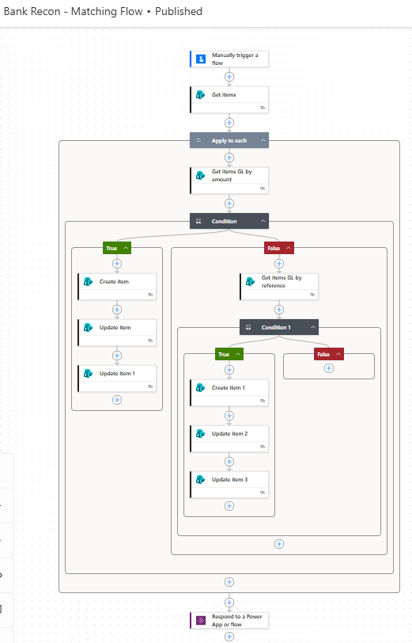
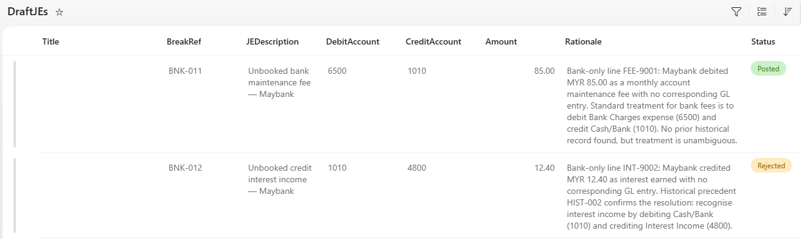
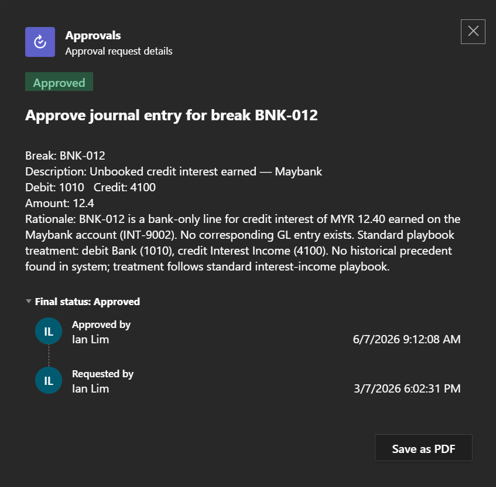
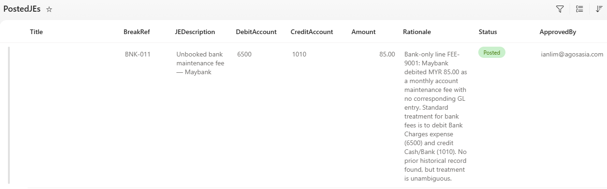
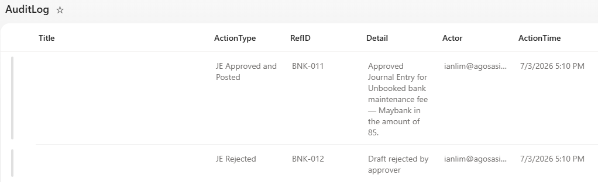

# AI-Powered Bank Reconciliation Agent

An autonomous Power Automate workflow that matches daily GL cash entries against bank statements and drafts corrective journals using AI reasoning.

## 📌 The Business Problem
Manual bank reconciliation is highly repetitive and prone to human error. Finance teams spend hours matching deterministic records and guessing the correct treatment for breaks like unbooked bank fees or FX mismatches. 

## 🛠️ The Solution
I developed a dual-layered automation:
* **Deterministic Matching:** A rules-based flow that accurately pairs clean records based on exact amounts and references.
* **Non-Deterministic AI Agent:** An autonomous Copilot agent that analyzes the leftover "breaks," queries a historical knowledge base for precedents, and drafts proposed journal entries for human approval.

## 💻 Technologies Used
* Microsoft Power Automate
* Copilot Studio (AI Agents)
* SharePoint (Mock Database)
* JSON & Prompt Engineering

## 🚀 How It Works
1. Flow reads daily Bank and GL data.
2. Rules engine matches clean items.
3. AI Agent is triggered for open breaks.
4. Agent searches historical fixes and drafts journals.
5. Approval routing (Human-in-the-loop) via email.
6. Final results write to Audit Logs and Posted Journals.

## 📸 Project Showcase

### 1. The Input Data (Relational Sandbox)
*Bank transactions and GL Cash entries awaiting reconciliation.*

  
   

### 2. The Architecture (Deterministic Rules)
*The Power Automate flow identifying exact matches and isolating breaks.*

### 3. The AI Core (Agent Reasoning)
*The Copilot agent applying accounting rules and citing historical precedent to draft journals.*

### 4. Human-in-the-Loop Control
*Drafted journals require explicit human approval via email before posting.*

### 5. Final Output & Audit Trail
*Approved journals are posted, and all system actions are logged with timestamps.*

  
   

## 🔒 Outcomes & Controls
Designed with strict human-in-the-loop controls. The AI is restricted to drafting journals based *only* on strict historical precedent. Ambiguous breaks are automatically escalated to a human, preventing hallucinated accounting entries.
